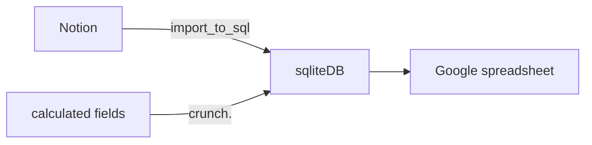

# Habit tracker conversion
Convert from Notion page to spreadsheet.
still need to find out a better format for spreadsheet.

## Flow of data



## News
### 2025-05-05
- Updated from Notion to Sqllite.
- All fields in Sqlite are amended.
TODO:
  - add more calculable fields to crunch.py and run it.
  - Duplicate sheet in spreadsheet and populate it with updated numbers. check difference between two sheets


# Bits
rename markdown files exported from Notion:
```bash
for a in *.md; do
  if [[ ! "$a" =~ ^20 ]]; then
    d=$(grep -hE "^Date: " "$a" | cut -d" " -f2 | gsed -E "s|([0-9]{2})/([0-9]{2})/([0-9]{4})|\\3-\\1-\\2|")
    echo mv "$a" "$d-$a"
    mv "$a" "$d-$a"
  fi
done
```

