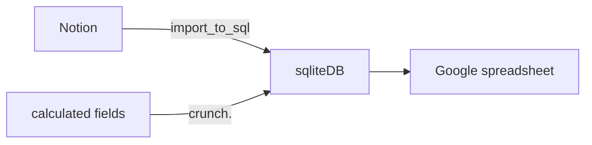

# Habit tracker conversion
Convert from Notion page to spreadsheet.
still need to find out a better format for spreadsheet.

## Flow of data



## News
### 2025-06-23
- updated from Notion to SQLite
- I tried to play with Google form as a new way to input data. but it doesn't open in fill-in mode for me, I can only edit it of preview (without being able to fill it). I have to change google account to fill the form. Plus answers doesn't have default values which is crucial for me during the workout.
- other Idea I have - create a spreadsheet there all exercises are in one column e.g. Date-exercise-value columns. one gym session will logged in several lines, but it'll look more compact. Exercise column can be a dropdown box. it might be automated to fill default for value column too.
  - this will require an import from sqlite:habit_data table to a newer table, since sqlite is a source of truth.
  - also it'll require newer import module from notion to sqlite (or spreadsheet).

### 2025-06-09
- updated from Notion to SQLite
- fixed import of row machine line
- `all_data` google Sheet and table view
- added `Incline dumbbells press` and `Lat raises` columns to `all_data` sheet

### 2025-05-29
- updated from Notion to SQLite
- shuffled fields in `all data` google Sheet to group data together.
- new view in SQLite to reflect shuffled fields in Google sheet

### 2025-05-25
- Updated from Notion to Sqllite.
- All fields in Sqlite are amended.
- crunching all fields

### 2025-05-05
- Updated from Notion to Sqllite.
- All fields in Sqlite are amended.
TODO:
  - add more calculable fields to crunch.py and run it.
  - Duplicate sheet in spreadsheet and populate it with updated numbers. check difference between two sheets


# Bits
rename markdown files exported from Notion:
```bash
for a in *.md; do
  if [[ ! "$a" =~ ^20 ]]; then
    d=$(grep -hE "^Date: " "$a" | cut -d" " -f2 | gsed -E "s|([0-9]{2})/([0-9]{2})/([0-9]{4})|\\3-\\1-\\2|")
    echo mv "$a" "$d-$a"
    mv "$a" "$d-$a"
  fi
done
```

