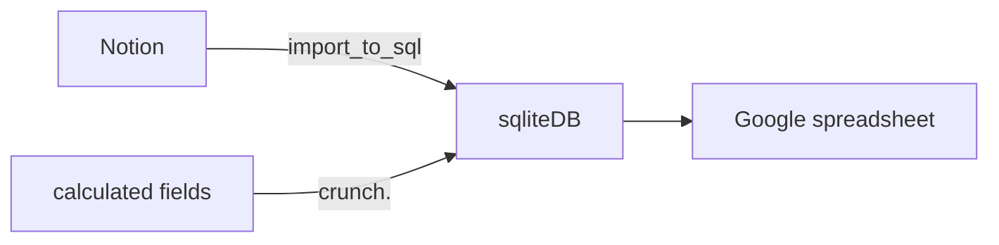

# Habit tracker conversion
Convert from Notion page to spreadsheet.
still need to find out a better format for spreadsheet.

## Flow of data



## Source of truth
For now source of truth is `reshaped` sheet ~~sqlite DB~~.
I have all rows manually edited to fit into one formula.

## News
### 2025-08-08
- New format of files in Notion. Now it contains boolean field мельдоний.
- New files from Notion are imported to `reshaped_data` table in SQL with help of [import_to_reshaped.py](./import_to_reshaped.py). Then new rows are manually copied to `reshaped` sheet.
- [import_to_reshaped.py](./import_to_reshaped.py) was written based on `import_to_sql.py`. It extracts new exercises like `dumbbell row`, `plank`, HIIT exercises like `fly`, and new fields `Мельдоний`, `feeling`.

### 2025-06-29
- converted habit_data to `reshaped` table in sqlite3 db with use of [melt.py](melt.py),
- Imported `reshaped` data to google sheets. the sheet has a lot of amendments thus reimport is quite hard to repeat.
- **source of truth** is now in `reshaped` sheet. new data should be added directly to the sheet.
- created bunch of pivot tables and graphs based on reshaped data. Graphs are identical to old ones, so data and result are the same.
- adding new line to the list of reshaped automatically recalculates pivot tables and graphs - what we needed.
- now I need to learn how to add new lines easily from iphone. this task is crucial for migration.
  - ideal would be a button starting a macros which creates several lines on top of the sheet and prepoulates them with:
    - current date
    - several relevant exercises like `row_machine`, `bench_press`, `lat_rises`, `meldoniy`, `conditions`, `fitband_duration`, `fitband_heartrate`, `fitband_kcal`
    - get recent values for each exercise

### 2025-06-23
- updated from Notion to SQLite
- I tried to play with Google form as a new way to input data. but it doesn't open in fill-in mode for me, I can only edit it of preview (without being able to fill it). I have to change google account to fill the form. Plus answers doesn't have default values which is crucial for me during the workout.
- other Idea I have - create a spreadsheet there all exercises are in one column e.g. Date-exercise-value columns. one gym session will logged in several lines, but it'll look more compact. Exercise column can be a dropdown box. it might be automated to fill default for value column too.
  - this will require an import from sqlite:habit_data table to a newer table, since sqlite is a source of truth.
  - also it'll require newer import module from notion to sqlite (or spreadsheet).

### 2025-06-09
- updated from Notion to SQLite
- fixed import of row machine line
- `all_data` google Sheet and table view
- added `Incline dumbbells press` and `Lat raises` columns to `all_data` sheet

### 2025-05-29
- updated from Notion to SQLite
- shuffled fields in `all data` google Sheet to group data together.
- new view in SQLite to reflect shuffled fields in Google sheet

### 2025-05-25
- Updated from Notion to Sqllite.
- All fields in Sqlite are amended. 
- crunching all fields

### 2025-05-05
- Updated from Notion to Sqllite.
- All fields in Sqlite are amended.
TODO:
  - add more calculable fields to crunch.py and run it.
  - Duplicate sheet in spreadsheet and populate it with updated numbers. check difference between two sheets


# Bits
rename markdown files exported from Notion:
```bash
for a in *.md; do
  if [[ ! "$a" =~ ^20 ]]; then
    d=$(grep -hE "^Date: " "$a" | cut -d" " -f2 | gsed -E "s|([0-9]{2})/([0-9]{2})/([0-9]{4})|\\3-\\1-\\2|")
    echo mv "$a" "$d-$a"
    mv "$a" "$d-$a"
  fi
done
```

